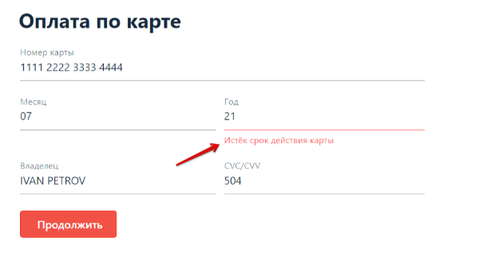

# План автоматизации тестирования сценариев покупки тура
***
## 1. Перечень автоматизируемых сценариев.
### 1.1. Сценарии покупки тура с оплатой дебетовой картой
***Валидные входные данные для оплаты:***

- **Поле Номер карты:** номер карты для одобренной покупки 1111 2222 3333 4444, номер карты для неодобренной покупки 5555 6666 7777 8888
- **Поле Месяц:** цифровое значение месяца, соответствующее дате, которая не раньше текущего месяца текущего года. Например, 07.
- **Поле Год:** две последние цифры года, соответствующие дате, которая не раньше текущего месяца текущего года и не позже, чем через 6 лет от текущего года. Например, 28.
- **Поле Владелец:** имя фамилия латинскими прописными буквами. Например, IVAN PETROV.
- **Поле CVC/CVV:** три цифры от 0 до 9. Например, 504.

#### *ПДК.1. Покупка тура с помощью дебетовой карты с использованием валидных данных с номером одобренной карты*
*Шаги:*
1. На странице приложения "Путешествие дня" нажать кнопку "Купить".

2. В выпадающем блоке "Оплата по карте" ввести валидные данные для оплаты, выбрав номер одобренной карты.

3. Нажать кнопку "Продолжить".

*Ожидаемый результат:*
1. Сообщение: "Успешно. Операция одобрена Банком."

#### *ПДК.2. Покупка тура с помощью дебетовой карты с использованием валидных данных с номером неодобренной карты*
*Шаги:*
1. На странице приложения "Путешествие дня" нажать кнопку "Купить".
2. В выпадающем блоке "Оплата по карте" ввести валидные данные для оплаты, выбрав номер неодобренной карты.
3. Нажать кнопку "Продолжить".

*Ожидаемый результат:*
1. Сообщение: "Ошибка! Банк отказал в проведении операции"

#### *ПДК.3. Покупка тура с помощью дебетовой карты с указанием не тестового номера карты:*
*Шаги:*
1.	На странице приложения "Путешествие дня" нажать кнопку "Купить".
2.	В выпадающем блоке "Оплата по карте" в поле Номер карты ввести значение
    1111 2222 3333 4456, в остальные поля ввести валидные данные для оплаты.
3.	Нажать кнопку "Продолжить".

*Ожидаемый результат:*
1. Сообщение: "Ошибка! Банк отказал в проведении операции."

#### *ПДК.4. Покупка тура с помощью дебетовой карты с указанием невалидного номера карты*
***Невалидное значение номера карты:***
- пустое поле
- русские или латинские буквы
- специальные символы

*Шаги:*
1.	На странице приложения "Путешествие дня" нажать кнопку "Купить".
2.	В выпадающем блоке "Оплата по карте" ввести невалидное значение в поле Номер карты, а в остальные поля ввести валидные данные для оплаты.
3.	Нажать кнопку "Продолжить".

*Ожидаемый результат:*
1. Поле Номер карты не заполняется.
2. После отправки формы с пустым полем Номер карты, поле становится красного цвета, и под ним появляется надпись: "Неверный формат".

#### *ПДК.5. Покупка тура с помощью дебетовой карты с указанием числового невалидного месяца*
***Числовое невалидное значение месяца:***
- любые две цифры, кроме цифровых значений месяца (от 01 до 12)
- цифровые значения от 01 до 09, если значение года будет равно 23

*Шаги:*
1.	На странице приложения "Путешествие дня" нажать кнопку "Купить".
2.	В выпадающем блоке "Оплата по карте" ввести невалидное значение в поле Месяц, а в остальные поля ввести валидные данные для оплаты.
3.	Нажать кнопку "Продолжить".

*Ожидаемый результат:*
1. Поле Месяц заполняется.
2. После отправки формы поле становится красного цвета, и под ним появляется надпись: "Неверно указан срок действия карты".

#### *ПДК.6. Покупка тура с помощью дебетовой карты с указанием нечислового невалидного месяца*
***Невалидное значение месяца:***
- пустое поле
- русские или латинские буквы
- специальные символы

*Шаги:*
1.	На странице приложения "Путешествие дня" нажать кнопку "Купить".
2.	В выпадающем блоке "Оплата по карте" ввести невалидное значение в поле Месяц, а в остальные поля ввести валидные данные для оплаты.
3.	Нажать кнопку "Продолжить".
 
*Ожидаемый результат:*
1. Поле Месяц не заполняется. 
2. После нажатия кнопки "Продолжить" с пустым полем Номер карты, поле становится красного цвета, и под ним появляется надпись: "Неверный формат".

#### *ПДК.7. Покупка тура с помощью дебетовой карты с указанием числового невалидного года*
***Числовое невалидное значение года:***
- любые две цифры, кроме от 24 до 28
- если значение месяца от 10 до 12, то можно указать цифру 23

*Шаги:*
1.	На странице приложения "Путешествие дня" нажать кнопку "Купить".
2.	В выпадающем блоке "Оплата по карте" ввести невалидное значение в поле Год, а в остальные поля ввести валидные данные для оплаты.
3.	Нажать кнопку "Продолжить".

*Ожидаемый результат:*
1. Поле Год заполняется. 
2. После отправки формы поле становится красного цвета, и под ним появляется надпись: "Неверно указан срок действия карты", если указана дата позже 28 года, или "Истек срок действия карты", если указана дата ранее текущего месяца текущего года

#### *ПДК.8. Покупка тура с помощью дебетовой карты с указанием нечислового невалидного года*
***Невалидное значение месяца:***
- пустое поле
- русские или латинские буквы
- специальные символы

*Шаги:*
1.	На странице приложения "Путешествие дня" нажать кнопку "Купить".
2.	В выпадающем блоке "Оплата по карте" ввести невалидное значение в поле Год, а в остальные поля ввести валидные данные для оплаты.
3.	Нажать кнопку "Продолжить". 

*Ожидаемый результат:*
1. Поле Год не заполняется. 
2. После нажатия кнопки "Продолжить" с пустым полем Номер карты, поле становится красного цвета, и под ним появляется надпись: "Неверный формат".

#### *ПДК.9. Покупка тура с помощью дебетовой карты с указанием пустого поля владелец*
*Шаги:*
1.	На странице приложения "Путешествие дня" нажать кнопку "Купить".
2.	В выпадающем блоке "Оплата по карте" ввести пробел или ничего не ввести в поле Владелец, а в остальные поля ввести валидные данные для оплаты.
3.	Нажать кнопку "Продолжить".
      
*Ожидаемый результат:*
1. Поле становится красного цвета, и под ним появляется надпись: "Поле обязательно для заполнения".

#### *ПДК.10. Покупка тура с помощью дебетовой карты с указанием невалидного имени владельца*
***Невалидное значение имени владельца:***
- цифры
- специальные символы
- русские буквы
- латинские строчные буквы

*Шаги:*
1.	На странице приложения "Путешествие дня" нажать кнопку "Купить".
2.	В выпадающем блоке "Оплата по карте" ввести невалидное значение в поле Владелец, а в остальные поля ввести валидные данные для оплаты.
3.	Нажать кнопку "Продолжить".

*Ожидаемый результат:*
1. Поле Владелец не заполняется. 
2. После нажатия кнопки "Продолжить" с пустым полем Владелец, поле становится красного цвета, и под ним появляется надпись: "Неверный формат".

#### *ПДК.11. Покупка тура с помощью дебетовой карты с указанием невалидного CVC/CVV*
***Невалидное значение CVC/CVV:***
- пустое поле
- русские или латинские буквы
- специальные символы

*Шаги:*
1.	На странице приложения "Путешествие дня" нажать кнопку "Купить".
2.	В выпадающем блоке "Оплата по карте" ввести невалидное значение в поле CVC/CVV, а в остальные поля ввести валидные данные для оплаты.
3.	Нажать кнопку "Продолжить".
      
*Ожидаемый результат:*
1. Поле CVC/CVV не заполняется. 
2. После нажатия кнопки "Продолжить" с пустым полем Номер карты, поле становится красного цвета, и под ним появляется надпись: "Неверный формат".

## 2. Перечень используемых инструментов с обоснованием выбора
1.	Редактор кода IntelliJ IDEA (включает возможность работы с Git и базами данных)
2.	Язык программирования Java
3.	Сборщик проектов Gradle (проще записывать конструкции в файле с настройками, а также для отчета)
4.	Тестовая платформа JUnit5 (хорошо подходит для тестирования)
5.	Фреймворк для автотестирования веб-приложений Selenide (более мощные селекторы)
6.	Система контроля версий Git
7.	Площадка для хранения тестов GitHub
8.	DevTools (необходим для поиска локаторов)
9.	Allure (требуется для отчета)
10. Docker Desktop (для доступа к базе данных и к симулятору).

## 3. Перечень и описание возможных рисков при автоматизации
1.	Технический сбой на сайте или сбой используемых инструментов, в т.ч. Интернет, железо и пр.
2.	Отсутствие специальных тестовых меток в коде сайта и невозможность их добавить. В результате лишние траты времени на разработку локаторов и селекторов
3.	Человеческий фактор в виде недееспособности специалиста

## 4. Интервальная оценка с учетом рисков в часах
- Если риски не возникли, то 20-30 часов
- Если риски возникли, то 30-50 часов

## 5. План сдачи работ: когда будут проведены автотесты, результаты их проведения и отчёт по автоматизации
      Я не очень понимаю, что я должна здесь написать?
      Когда будут проведены автотесты - это конкретную дату нужно указать?
      Результаты их проведения - это ожидаемые результаты? Если фактические, то странно - это ведь планирование.
      Отчет по автоматизации - что мне нужно написать в планировании про отчет по автоматизации? Он будет.
